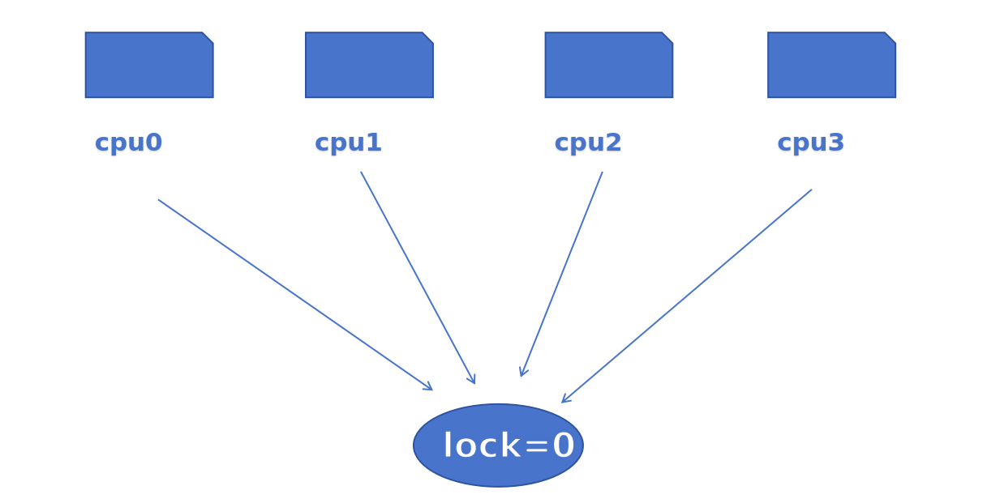
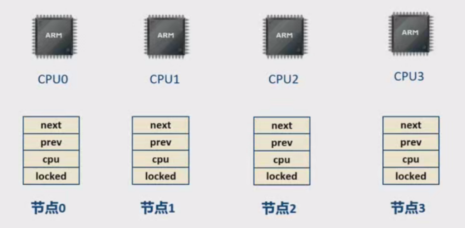
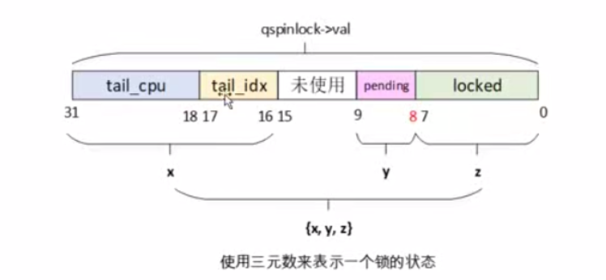
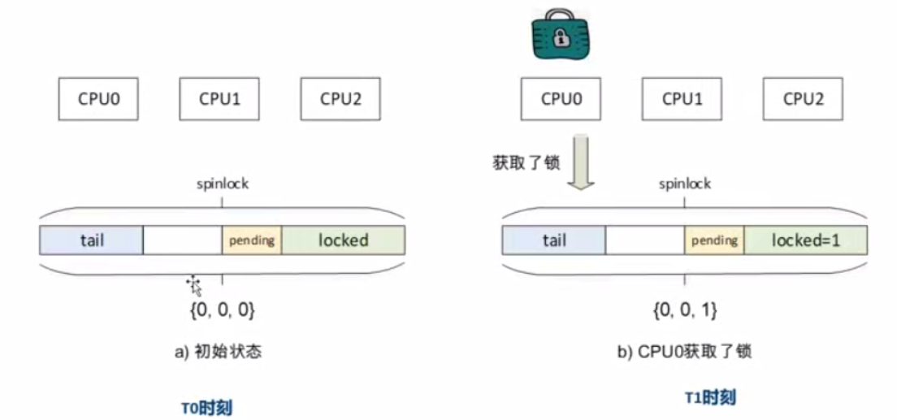
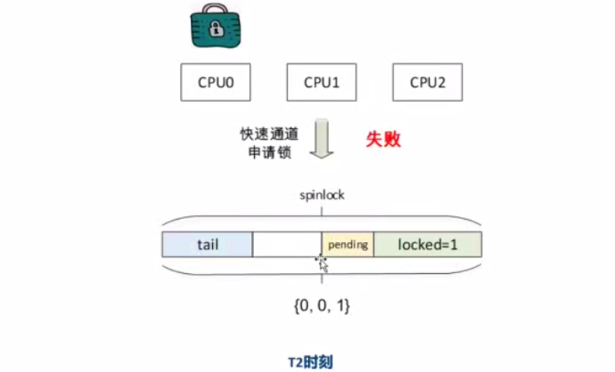
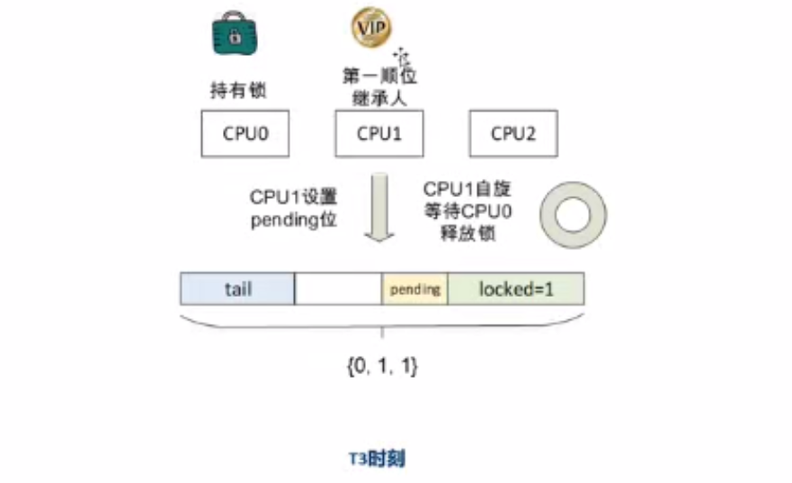

<!--
 * @Date: 2025-03-25
 * @LastEditors: error: git config user.name & please set dead value or install git
 * @LastEditTime: 2025-04-09
 * @FilePath: /spinlock/qspinlock.md
 * @Description: 
--> 
## spinlock

原子操作几乎是基于硬件实现的，但是保护的范围有限，比如CAS指令最大支持64bit（8字节大小），但是实际链表，二叉树等操作集合很大，对其操作是一个过程，不适合，自旋锁会让内核代码路径（进程或中断处理程序）自旋等待，锁可以分为两种：**忙等待和睡眠等待**，自旋锁的临界区中的代码要尽快执行完成，不能调度或者睡眠，自旋锁可以在（软，硬件，不可屏蔽）中断上下文或进程上下文使用，即CPU只能在自旋锁的临界区里面执行。


#### 1. spinlock：

- 有公平性问题，缓存一致性开销，CPU核心越大，cache需求越厉害，缺乏可扩展性

假设CPU0....同时抢占一个经典的spinlock锁


#### 2. Ticket spinlock：
```diff
diff --git a/arch/riscv/include/asm/spinlock_types.h b/arch/riscv/include/asm/spinlock_types.h
index f398e76..d7b38bf 100644
--- a/arch/riscv/include/asm/spinlock_types.h
+++ b/arch/riscv/include/asm/spinlock_types.h
@@ -10,16 +10,21 @@
 # error "please don't include this file directly"
 #endif
 
+#define TICKET_NEXT	16
+
 typedef struct {
-	volatile unsigned int lock;
+	union {
+		u32 lock;
+		struct __raw_tickets {
+			/* little endian */
+			u16 owner;
+			u16 next;
+		} tickets;
+	};
 } arch_spinlock_t;
```
- 解决了公平问题，但所有核都轮询同一个owner，read cache line 成热点


**MCS算法：**

- 每个线程在本地spin，无共享变量轮询（不像 classic/ticket 那样）

**qspinlock：** 

- 每个核只盯自己的局部变量排队，cache line 不共享，失效/嗅探最少


--- 

**MCS锁**

> 本质上是一种基于链表结构的自旋锁
> 每个锁申请的过程中它在自己的本地的CPU变量上去自旋，而不是像经典的spinlock实现一样在全局的变量中自旋

1. MCS锁基于链表结构的自旋锁，锁本身是一个 atomic_mcs_node_t *lock 指针，指向MCS链表的末尾。
2. 每个CPU有一个对应的节点，节点包含lock成员，CPU在节点上自选等待锁。
3. 当CPU持有锁时，其他CPU来申请锁时会依次排队，把自己的节点链接到当前CPU节点后面。
4. 解锁时，当前CPU会把自己的节点从链表中摘除，并把锁传递给下一个节点。

- 每个 CPU 线程创建的 node 结构都是一样的，但它们是独立的，每个线程都有自己的 node 实例。
typedef struct mcs_node {
     struct mcs_node *next;  // 指向下一个等待的线程
    bool locked;            // 是否持有锁
} mcs_node_t;


**MCS算法**

MCS 仍然是自旋锁，但每个线程只在自己的 mcs_node_t 变量上自旋，而不是共享变量 lock 上。
这样避免了 多个 CPU 访问同一个锁变量导致的缓存一致性流量，即 避免了 CPU 间的“锁争夺”导致的总线流量问题。
但是线程仍然在 CPU 上忙等，不会主动让出 CPU，因此 如果线程调度时间过长，仍然会造成 CPU 资源浪费。
- MCS 的特点是：它优化了自旋锁的缓存一致性问题，但并不等于它是“阻塞锁”。


## qspinlock
**include/asm-generic/qspinlock_types.h:** 锁数据结构
```c
typedef struct qspinlock {
        union {
                atomic_t val;

                /*
                 * By using the whole 2nd least significant byte for the
                 * pending bit, we can allow better optimization of the lock
                 * acquisition for the pending bit holder.
                 */
#ifdef __LITTLE_ENDIAN
                struct {
                        u8      locked;
                        u8      pending;
                };
                struct {
                        u16     locked_pending;
                        u16     tail;
                };
#else
                struct {
                        u16     tail;
                        u16     locked_pending;
                };
                struct {
                        u8      reserved[2];
                        u8      pending;
                        u8      locked;
                };
#endif
        };
} arch_spinlock_t;

/*
 * Initializier
 */
#define __ARCH_SPIN_LOCK_UNLOCKED       { { .val = ATOMIC_INIT(0) } }

/*
 * Bitfields in the atomic value:
 *
 * When NR_CPUS < 16K
 *  0- 7: locked byte
 *     8: pending
 *  9-15: not used
 * 16-17: tail index
 * 18-31: tail cpu (+1)
 *
 * When NR_CPUS > = 16K
 *  0- 7: locked byte
 *     8: pending
 *  9-10: tail index
 * 11-31: tail cpu (+1)
 */
#define _Q_SET_MASK(type)       (((1U << _Q_ ## type ## _BITS) - 1)\
                                      << _Q_ ## type ## _OFFSET)
#define _Q_LOCKED_OFFSET        0
#define _Q_LOCKED_BITS          8
#define _Q_LOCKED_MASK          _Q_SET_MASK(LOCKED)
```



**kernel/locking/mcs_spinlock.h**
```c
struct mcs_spinlock {
        struct mcs_spinlock *next;
        int locked; /* 1 if lock acquired */
        int count;  /* nesting count, see qspinlock.c */
};
```
`locked = 1`:只是说锁传到了当前加节点，但是当前节点还需要主动申请锁(qspinlock-> locked = 1)
`count`：四种上下文

**kernel/locking/qspinlock.c:**
```c
#define MAX_NODES       4

struct qnode {
        struct mcs_spinlock mcs;
#ifdef CONFIG_PARAVIRT_SPINLOCKS
        long reserved[2];
#endif
};

/*
 * Per-CPU queue node structures; we can never have more than 4 nested
 * contexts: task, softirq, hardirq, nmi.
 *
 * Exactly fits one 64-byte cacheline on a 64-bit architecture.
 *
 * PV doubles the storage and uses the second cacheline for PV state.
 */
static DEFINE_PER_CPU_ALIGNED(struct qnode, qnodes[MAX_NODES]);
```
**申请锁：**
**include/asm-generic/qspinlock.h**
:try_cmpxchg
:slowpatch-> kerner/locking/qspinlock.c
val & ~Q_LOCKED_MASK:tail(true) ->  goto queue
否则，queue中为空，当前cpu直接为队列头->  locked = 1,返回lockval旧值
检查中间是否有其它cpu进入

0,1,1(自旋等待锁) ->  0,0,1(得到锁)：退出循环

| 申请         | 操作                                                                                                                                                |
| ------------ | --------------------------------------------------------------------------------------------------------------------------------------------------- |
| 快速申请通道 | 这个锁当前没有人持有，直接通过cmpxchg()设置locked域即可获取了锁。                                                                                   |
| 中速申请通道 | 锁已经被人持有，但是MCS链表没有其他人，有且仅有一个人在等待这个锁。设置pending域，表示是第一顺位继承者，自旋等待lock-> locked清0，即锁持有者释放锁。 |


- val == _Q_PENDING_VAL:0,1,0 ->  锁处于临界状态，锁的持有者正在释放锁


qspinlock的研究（尽量贴近risc-v，从使用者和开发者的角度进行深入研究）


