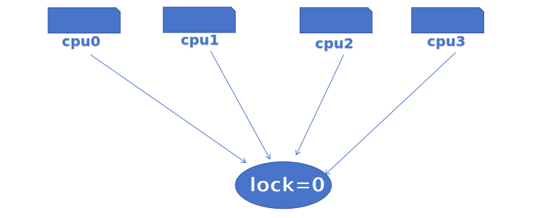
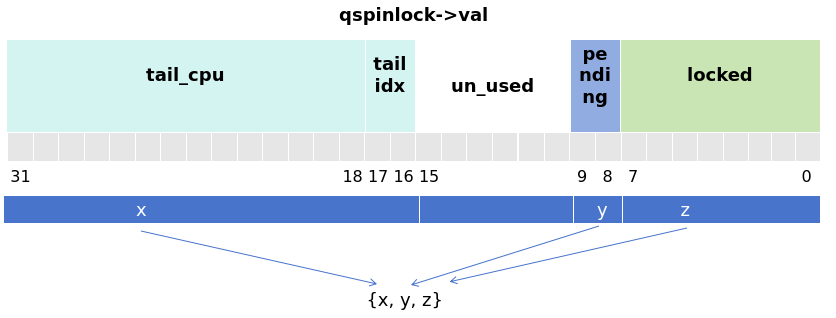
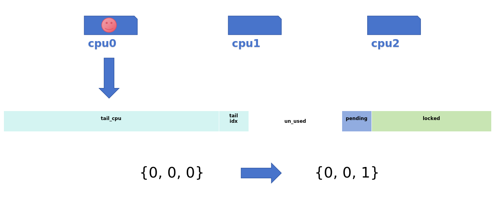
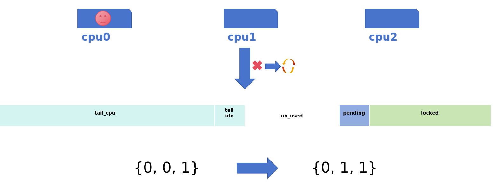
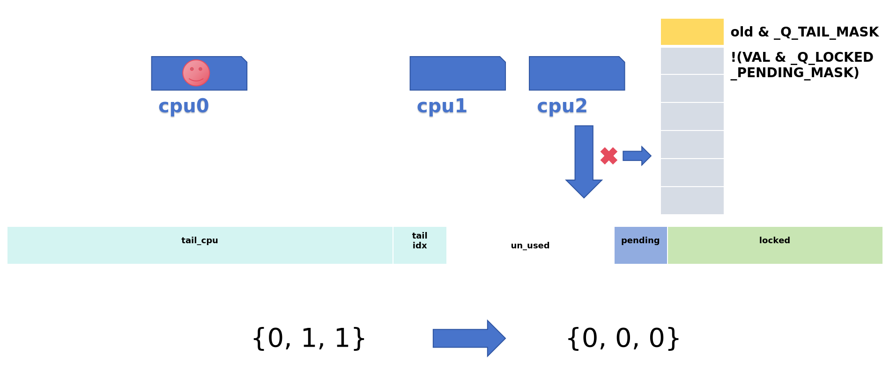

## spinlock

#### 1. 传统spinlock：

- 传统的spinlock有公平性问题.，缓存一致性开销，CPU核心越大，cache需求越厉害，缺乏可扩展性



#### 2. Ticket spinlock
```c
#define TICKET_NEXT	16

typedef struct {
	union {
		u32 lock;
		struct __raw_tickets {
			/* little endian */
			u16 owner;
			u16 next;
		} tickets;
	};
} arch_spinlock_t;

my_ticket = atomic_fetch_inc(&lock->tickets.next);

 while (lock->tickets.owner != my_ticket)
    cpu_relax();
```
- 解决了公平问题，防止某些 CPU 永远得不到锁，但所有核都轮询同一个owner变量，read cache line成热点，限制扩展性

#### 3. MCS lock

- 本质上是一种基于链表结构的自旋锁，每个CPU有一个对应的节点(锁的副本)，基于各自不同的副本变量进行等待，锁本身是共享的，但队列节点是线程自己维护的，每个CPU只需要查询自己对应的本地cache line，仅在这个变量发生变化的时候，才需要读取内存和刷新这条cache line, 不像 classic/ticket对共享变量进行spin

```c
struct mcs_spinlock {
	struct mcs_spinlock *next;
	int locked; /* 1 if lock acquired */
	int count;  /* nesting count, see qspinlock.c */
};

static inline
void mcs_spin_lock(struct mcs_spinlock **lock, struct mcs_spinlock *node)
{
	struct mcs_spinlock *prev;

	/* Init node */
	node->locked = 0;
	node->next   = NULL;

	prev = xchg(lock, node);
	if (likely(prev == NULL)) {
		return;
	}
	WRITE_ONCE(prev->next, node);

	/* Wait until the lock holder passes the lock down. */
	arch_mcs_spin_lock_contended(&node->locked);
}
```
- 每个 CPU 线程创建的node 是独立的，每个线程都有自己的 node 实例。但是结构体中多了一个指针使结构体变大了，导致了“内存开销问题”：MCS 锁把竞争带来的 cache-line 抖动降低了，但牺牲了一些内存和部分结构管理的成本。


#### 4. qspinlock
**include/asm-generic/qspinlock_types.h:** 锁数据结构
```c
typedef struct qspinlock {
        union {
                atomic_t val;

                /*
                 * By using the whole 2nd least significant byte for the
                 * pending bit, we can allow better optimization of the lock
                 * acquisition for the pending bit holder.
                 */
#ifdef __LITTLE_ENDIAN
                struct {
                        u8      locked;
                        u8      pending;
                };
                struct {
                        u16     locked_pending;
                        u16     tail;
                };
#else
                struct {
                        u16     tail;
                        u16     locked_pending;
                };
                struct {
                        u8      reserved[2];
                        u8      pending;
                        u8      locked;
                };
#endif
        };
} arch_spinlock_t;

/*
 * Initializier
 */
#define __ARCH_SPIN_LOCK_UNLOCKED       { { .val = ATOMIC_INIT(0) } }

/*
 * Bitfields in the atomic value:
 *
 * When NR_CPUS < 16K
 *  0- 7: locked byte
 *     8: pending
 *  9-15: not used
 * 16-17: tail index
 * 18-31: tail cpu (+1)
 *
 * When NR_CPUS > = 16K
 *  0- 7: locked byte
 *     8: pending
 *  9-10: tail index
 * 11-31: tail cpu (+1)
 */
#define _Q_SET_MASK(type)       (((1U << _Q_ ## type ## _BITS) - 1)\
                                      << _Q_ ## type ## _OFFSET)
#define _Q_LOCKED_OFFSET        0
#define _Q_LOCKED_BITS          8
#define _Q_LOCKED_MASK          _Q_SET_MASK(LOCKED)
```

- `locked`：用来表示这个锁是否被人持有（0：无，1：有）
- `pending`：可以理解为最优先持锁位，即当unlock之后只有这个位的CPU最先持锁，也有1和0
- `tail`：有idx+CPU构成，用来标识等待队列的最后一个节点。
- `tail_idx`：就是index，它作为mcs_nodes数组的下标使用
- `tail_CPU`：用来表示CPU的编号+1，+1因为规定tail为0的时候表示等待队列中没有成员

**kernel/locking/mcs_spinlock.h**
```c
struct mcs_spinlock {
        struct mcs_spinlock *next;
        int locked; /* 1 if lock acquired */
        int count;  /* nesting count, see qspinlock.c */
};
```
`locked = 1`:只是说锁传到了当前加节点，但是当前节点还需要主动申请锁(qspinlock -> locked = 1)
`count`：针对四种上下文用于追踪当前用了第几个 node（即 idx），最大为4,不够用时就fallback不排队直接自旋


**kernel/locking/qspinlock.c:**
```c
#define MAX_NODES       4

struct qnode {
        struct mcs_spinlock mcs;
#ifdef CONFIG_PARAVIRT_SPINLOCKS
        long reserved[2];
#endif
};

/*
 * Per-CPU queue node structures; we can never have more than 4 nested
 * contexts: task, softirq, hardirq, nmi.
 *
 * Exactly fits one 64-byte cacheline on a 64-bit architecture.
 *
 * PV doubles the storage and uses the second cacheline for PV state.
 */
static DEFINE_PER_CPU_ALIGNED(struct qnode, qnodes[MAX_NODES]);
```
- 一个 CPU 上可能嵌套多个锁, 针对四种上下文情况下，例：进程上下文中发生中断后再次获取锁
- PER_CPU的优点是快，防止抢锁时再mallock或临时分配导致延迟，成本等问题


**申请锁：**

1. 快速申请
**include/asm-generic/qspinlock.h**
```c
/**
 * queued_spin_lock - acquire a queued spinlock
 * @lock: Pointer to queued spinlock structure
 */
static __always_inline void queued_spin_lock(struct qspinlock *lock)
{
	int val = 0;

	if (likely(atomic_try_cmpxchg_acquire(&lock->val, &val, _Q_LOCKED_VAL)))
		return;

	queued_spin_lock_slowpath(lock, val);
}
```


2. 中速申请

- 快速申请失败，queue中为空时，设置锁的pending位
- 再次检测（检查中间是否有其它cpu进入）
- 一直循环检测locked位
- 清除pending位
- 


3. 慢速申请




| 申请         | 操作                                                                                                                                                |
| ------------ | --------------------------------------------------------------------------------------------------------------------------------------------------- |
| 快速申请 | 这个锁当前没有人持有，直接通过cmpxchg()设置locked域即可获取了锁。                                                                                   |
| 中速申请 | 锁已经被人持有，但是MCS链表没有其他人，有且仅有一个人在等待这个锁。设置pending域，表示是第一顺位继承者，自旋等待lock-> locked清0，即锁持有者释放锁。 |
|慢速申请| 进入到queue中自旋等待


**end:**
- 如果只有1个或2个CPU试图获取锁，那么只需要一个4字节的qspinlock就可以了，其所占内存的大小和ticket spinlock一样。当有3个以上的CPU试图获取锁，需要一个qspinlock加上(N-2)个MCS node

- qspinlock中加入"pending"位域的意义，如果是两个CPU试图获取锁，那么第二个CPU只需要简单地设置"pending"为1，而不用创建一个MCS node

- 试图加锁的CPU数目超过3个，使用ticket spinlock机制就会造成多个CPU的cache line刷新的问题，而qspinlock可以利用MCS node队列来解决这个问题

- 从ticket spinlock到MCS lock，再到qspinlock，是对其一步步的优化的


